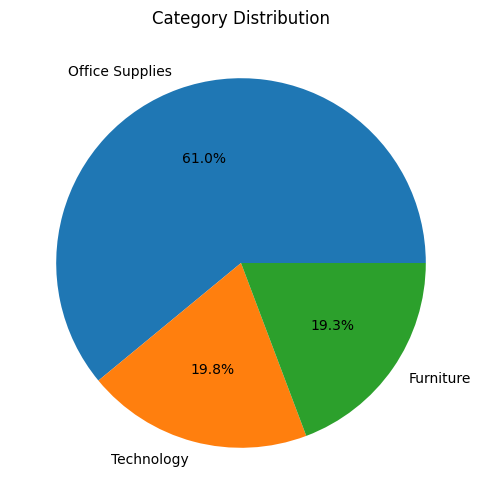
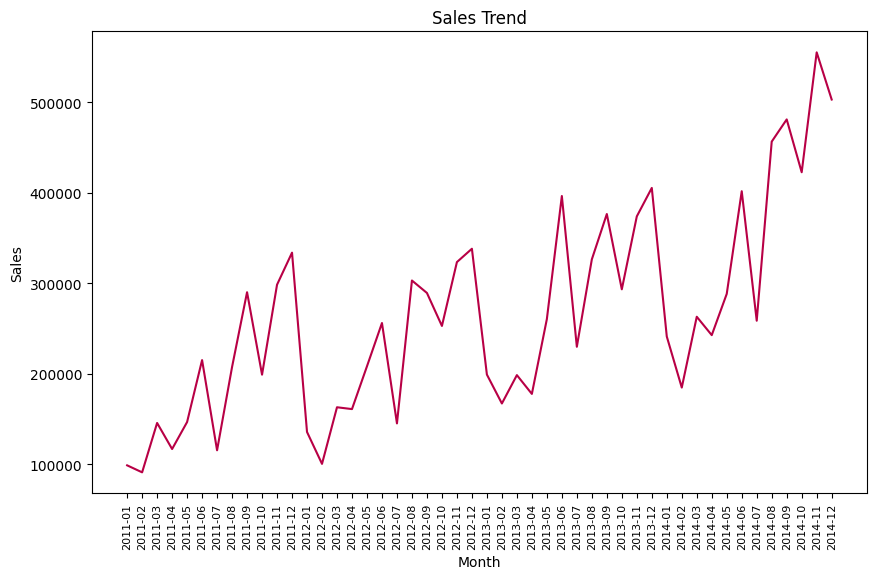
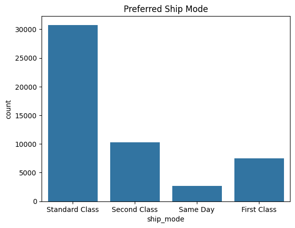

# Pandas-Sales-Analysis

## Table of Contents
- [Project Overview](#project-overview)
- [Data Sources](#data-sources)
- [Tools](#tools)
- [Data Cleaning/Preparation](#data-cleaningpreparation)
- [Exploratory Data Analysis](#exploratory-data-analysis)
- [Results/Findings](#resultsfindings)
- [Limitations](#limitations)

### Project Overview
---
This project aims to leverage the power of sales data to gain valuable insights and inform strategic decision-making within the sales department. By analyzing historical sales trends and product performance, we can identify areas for improvement and optimize our sales strategies to achieve sustainable growth.

### Data Sources

The project leverages a public dataset from github, super_store_sales.xlsx, our focus was on the Orders sheet, the sheet has 21 columns and 51290 rows, for our analysis, we focused on the following columns, order_date, ship_mode, sales, quantity, product_name
```python
df.shape
df.columns
```


### Tools
  - Microsoft Excel - Univariate Analysis
  - Microsoft PowerBI - Data Analysis, Data Processing, Data Preparation and Data Visualization
 
### Data Cleaning/Preparation

In the data preparation phase, we performed the following tasks:
1. Data loading and inspection
2. Data cleaning and formatting

```python
df.info()
df.describe()
df.isnull().sum()
```

### Exploratory Data Analysis

EDA involved exploring the datasets to answer key questions such as:
- How many products are in the dataset
```python
df['product_id'].nunique()
```
- How many categories are in the dataset
```python
df['category'].nunique()
cat_percent = df['category'].value_counts(normalize=True)*100
plt.figure(figsize=(6, 6))
plt.pie(cat_percent, labels=cat_percent.index, autopct="%1.1f%%")
plt.title("Category Distribution")
plt.show()
```

- How many sub categories are in the dataset
```python
df['sub_category'].nunique()
```
- How many countries appear in the dataset
```python
df['country'].nunique()
```
- What is the overall sales trend?
```python
df['month_year'] = df['order_date'].apply(lambda x: x.strftime('%Y-%m'))
df_trend = df.groupby('month_year')['sales'].sum().reset_index()
plt.figure(figsize=(10, 6))
sns.lineplot(x='month_year', y='sales', data=df_trend, color = '#b80045')
plt.title('Sales Trend')
plt.xlabel('Month')
plt.ylabel('Sales')
plt.xticks(rotation='vertical', size =8)
plt.show
```

- What are the top 10 products by sales
```python
prod_sales = pd.DataFrame(df.groupby('product_name')['sales'].sum().sort_values(ascending = False).reset_index())
prod_sales[:10]
```
- What are the most selling products
```python
prod_count = pd.DataFrame(df.groupby('product_name')['quantity'].sum().sort_values(ascending = False).reset_index()) 
prod_count[:10]
```
- What is the most preferred ship mode
```python
sns.countplot(x='ship_mode', data=df)
plt.title('Preferred Ship Mode')
plt.show()
```

- What are the most profitable categories and sub-categories
```
cat_subcat_profit_sort = pd.DataFrame(df.groupby(['category', 'sub_category'])['profit'].sum())
cat_subcat_profit_sort.sort_values(['category', 'profit'], ascending=False)
```

### Results/Findings
- 3 distinct categories exist within the data
- The dataset further breaks down these categories into 17 subcategories.
- 10,292 total products identified.
- Products were sold in 147 different countries.
- November 2014 saw the highest sales volume compared to other months
- The top-selling products by revenue were Apple, Cisco, and Motorola Smart Phones (Full Size), generating revenues of 86935.78, 76441.53, and 73156.30 respectively.
- Staples outsold all other products with 876 units, followed by Cardinal Index Tabs (Clear) at 337 units and Eldon File Carts (Single Width) at 321 units.
- Standard class emerged as the most popular shipping option for customers.


### Conclusion
This project successfully analyzed sales data to identify trends and patterns. The findings provide valuable insights into product performance, customer buying behavior, and shipping preferences. This information can be used to optimize product offerings, target marketing campaigns more effectively, and improve customer satisfaction through efficient shipping options.

### Limitations
The scope of the project might be limited to a specific timeframe within the available data.
The analysis may not consider factors influencing sales beyond the data provided (e.g., marketing campaigns, pricing strategies, economic conditions).
It's unclear if the data represents the entire product catalog or a specific subset.
